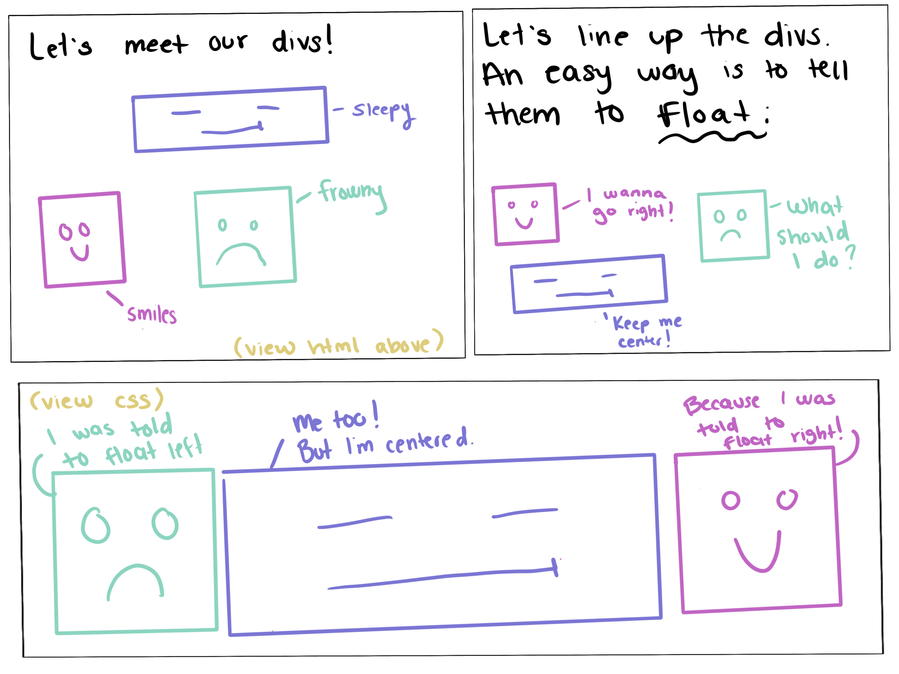

# Reading Assignment One
*Sections Read:*
- [CSS Tricks](https://css-tricks.com/all-about-floats/)
- [Responsive Web Design](https://learn.shayhowe.com/advanced-html-css/responsive-web-design/)

### YOU'LL FLOAT TOO: A comic on the basics of float
Let's say we have these `<div>` elements within out `<body` within out HTML.
```
<div id="smiles"></div>
<div id="frowny"></div>
<div id="sleepy"></div>
```


One of the easiest native ways to tell our sibling `<div>` elements to line up is by utilizing CSS floats. Since smiles wants to go right, and sleepy wants to stay centered we wold write our CSS like this. 

```
#frowny {
    float: left;
}

#sleepy {
    float: left;
}

#smiles {
    float: right;
}
```