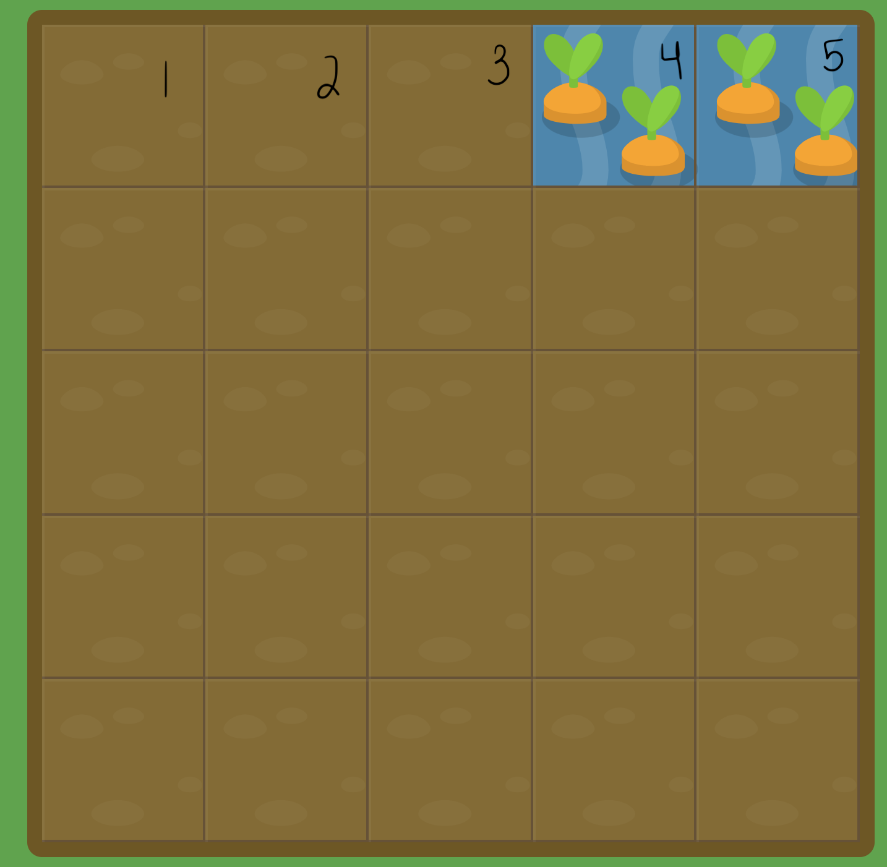
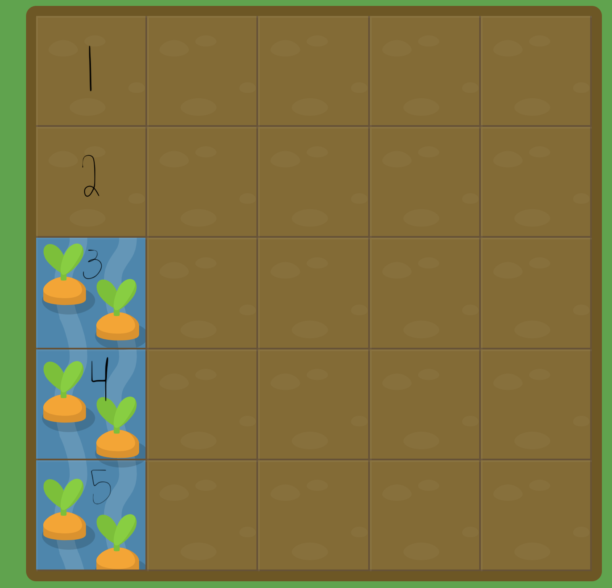

# Reading Assignment Four
*Secions Read:*
- [Grid Garden](https://cssgridgarden.com/)
- [CSS Guide to Gride](https://css-tricks.com/snippets/css/complete-guide-grid/)

### CSS: Intro to Grid Styling 
*The following screenshots are from Grid Garden tutorial*

Similar to Flexbox, the parent container needs to have their display set accordingly. 
```
#parent {
    display: grid;
    grid-template-columns: 20% 20% 20% 20% 20%;
    grid-template-rows: 20% 20% 20% 20% 20%;
}
```

`grid-template-columns: 20% 20% 20% 20% 20%` is telling your CSS that this parent container has a grid with 5 columns that each take up 20% of the parent container's width, whereas `grid-template-rows: 20% 20% 20% 20% 20%` is assigning five rows with a height of 20% of the parent container.

The four basic children element grid styling rules are `grid-column-start: <integer>;`, `grid-column-end: <integer>;`, `grid-row-start: <integer>;`, and `grid-row-end: <integer>;` 

Annotated below is a screenshot from the Grid Garden exercise. 




In order to acheive the water element to be in the grid boxes where our carrots our, our CSS would look like this. (To reiterate #water is a child element of our #parent.)

```
#water {
    grid-column-start: 4;
    grid-column-end: 6;
}
```

We are telling our CSS to start in grid column 4, and stretch over 5, and end at 6. 

We could also use the shorthand `grid-column: <start integer> / <end integer>;`
```
#water {
    grid-column: 4/6;
}
```
`grid-row-start` & `grid-row-end` behave similarily. Except stretching across columns, they moved down rows. They even have a similar short hand called `grid-row`.



Our css for moving the water to look like this would be:

```
#water {
    grid-row: 3/6;
}
```