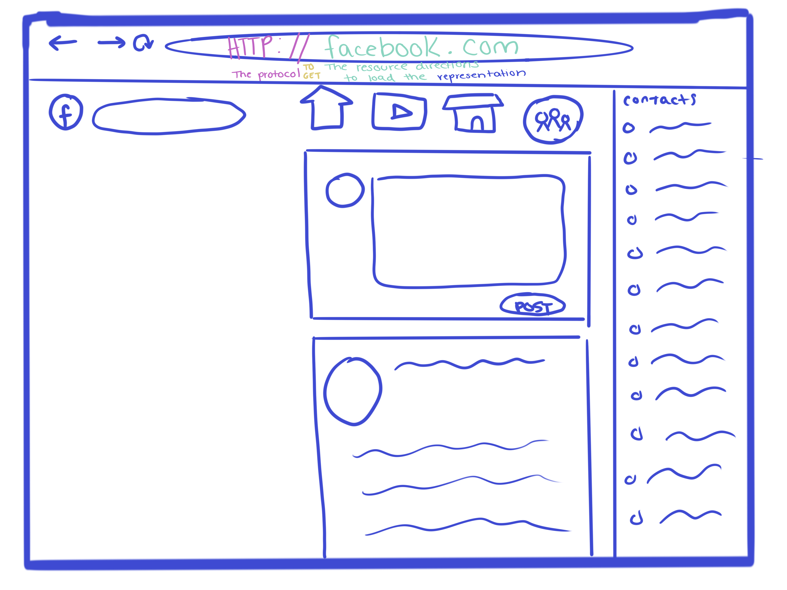

# Reading Assignment Seven
*Sections Read:*
- [REST article](https://gist.github.com/brookr/5977550)

### A Basic Breakdown on REST

As denoted by the pink: HTTP is the protocol for the web and how computers can 'speak' to each other. 

The URL are the directions to resources on the internet. Resources are concepts that then can be visualized by representations. A representation is typically a webpage, however API's count too. 

When one machine tells a machine to get information from a different machine, that is called a ridirect.  